# AutoSniper Video Flowchart

Experimental video-only artifact: these flowcharts are not sources of truth for the project. Use the repo code, datasets, tests, and project memory as the authoritative references.

Use [autosniper_video_flowchart.html](./autosniper_video_flowchart.html) as the recording board. Open it in a browser, zoom out for the whole system, then pan through the numbered sections.

## Mermaid Source

```mermaid
flowchart LR
  classDef source fill:#152033,stroke:#64b5f6,color:#eef5ff,stroke-width:2px
  classDef data fill:#14241d,stroke:#7bd88f,color:#eef5ff,stroke-width:2px
  classDef logic fill:#211a30,stroke:#c7a2ff,color:#eef5ff,stroke-width:2px
  classDef ai fill:#2a2114,stroke:#ffd166,color:#eef5ff,stroke-width:2px
  classDef risk fill:#2a171b,stroke:#ff8a8a,color:#eef5ff,stroke-width:2px
  classDef ui fill:#102235,stroke:#59d1ff,color:#eef5ff,stroke-width:2px
  classDef proof fill:#1f2530,stroke:#9fb2c7,color:#eef5ff,stroke-width:2px

  subgraph S1["1. Market Intake"]
    A1["Grays auction pages<br/>scripts/extract_links.py"]:::source
    A2["Listing detail scrape<br/>scripts/extract_vehicle_details.py"]:::source
    A3["Live bid refresh<br/>scripts/update_bids.py"]:::source
    A4["Carsales / Autotrader evidence<br/>Apify + manual imports"]:::source
  end

  subgraph S2["2. Working Datasets"]
    D1["all_vehicle_links.csv<br/>active_vehicle_links.csv"]:::data
    D2["raw_vehicle_data.csv<br/>normalised_data.csv"]:::data
    D3["vehicle_static_details.csv<br/>active_vehicle_details.csv"]:::data
    D4["vehicle_state.csv<br/>active_snapshots.csv"]:::data
    D5["sold_cars.csv<br/>referred_cars.csv"]:::data
  end

  subgraph S3["3. Normalisation + Coverage"]
    N1["Canonical tagging<br/>shared/canonical_tagging.py"]:::logic
    N2["Restricted operating universe<br/>scripts/build_restricted_datasets.py"]:::logic
    N3["Curve library<br/>curves.csv + versions"]:::logic
    N4["Curve governance<br/>allowed variants, manifests, coverage reports"]:::proof
    N5["Gap queues<br/>curve candidates + enrichment backlog"]:::proof
  end

  subgraph S4["4. Valuation Engine"]
    V1["Active monitor shortlist<br/>ops/active_monitor.py"]:::logic
    V2["Historical comparable sales<br/>shared/comps_engine.py"]:::logic
    V3["Curve-based resale estimate<br/>shared/curves.py"]:::logic
    V4["Repair assessment<br/>shared/repair_pricing.py"]:::logic
    V5["Auction price correction<br/>shared/auction_model.py"]:::ai
    V6["AI listing valuation<br/>scripts/ai_listing_valuation.py"]:::ai
  end

  subgraph S5["5. Decision Policy"]
    P1["Profit bands<br/>low / mid / high resale"]:::ai
    P2["Costs and frictions<br/>fees, transport, rego, RWC, prep, repairs"]:::ai
    P3["Auction-site proxy max<br/>economic ceiling + safety buffer"]:::ai
    P4["Shared action label<br/>Buy / Avoid / Review"]:::risk
  end

  subgraph S6["6. Operator Surfaces"]
    U1["Dashboard<br/>DASHBOARD.py"]:::ui
    U2["Active Inventory<br/>operational scraper/status view"]:::ui
    U3["AI Analysis<br/>pages/6_AI_ANALYSIS.py"]:::ui
    U4["Detail transparency<br/>pages/02_DETAIL.py"]:::ui
    U5["Health + Pipeline pages<br/>pages/05_HEALTH.py<br/>pages/12_GRAYS_PIPELINE.py"]:::ui
    U6["Telegram / decision events<br/>alerts on important changes"]:::ui
  end

  subgraph S7["7. Proof, Learning + Feedback"]
    F1["Model Proof + Calibration<br/>pages/17_MODEL_PROOF.py"]:::proof
    F2["Missed Opportunities replay<br/>pages/8_MISSED_OPPORTUNITIES.py"]:::proof
    F3["Historical calibration<br/>restricted sold outcomes"]:::proof
    F4["Retail-median simulation<br/>model_audit outputs"]:::proof
    F5["Repair Review + Pricing<br/>pages/18_REPAIR_REVIEW.py<br/>pages/19_REPAIR_PRICING.py"]:::proof
    F6["Governance checks<br/>readiness smoke, schema, curve validation"]:::proof
  end

  A1 --> D1
  D1 --> A2
  A2 --> D2
  D2 --> D3
  A3 --> D3
  A3 --> D4
  D3 --> D4
  D3 --> N1
  D5 --> N1
  N1 --> N2
  D3 --> N2
  D5 --> N2
  N2 --> V1
  N3 --> V1
  N3 --> V3
  D5 --> V2
  V1 --> V2
  V1 --> V3
  V1 --> V4
  V1 --> V5
  V2 --> V6
  V3 --> V6
  V4 --> V6
  V5 --> V6
  V6 --> P1
  P1 --> P2
  P2 --> P3
  P3 --> P4
  P4 --> U3
  P4 --> U2
  D3 --> U1
  D3 --> U2
  D3 --> U4
  D4 --> U5
  V6 --> U6
  U3 --> U4
  P4 --> F1
  D5 --> F1
  P4 --> F2
  D5 --> F2
  V6 --> F3
  D5 --> F3
  V6 --> F4
  D3 --> F4
  V4 --> F5
  F5 --> V4
  F1 --> F6
  F2 --> F6
  N4 --> F6
  F6 --> N3
  F6 --> N4
  N5 --> A4
  A4 --> N3
  A4 --> N4
  F2 -. "missed wins tune gates" .-> P4
  F3 -. "accuracy feedback" .-> V5
  F1 -. "proof of settled outcomes" .-> P4
```

## Recording Structure

1. Wide opening: AutoSniper turns live auction listings into bid decisions.
2. Market intake: Grays scraping and bid refreshes keep the working datasets current.
3. Data cleanup: raw listings become normalised, active, sold, referred, and state datasets.
4. Coverage: canonical tags and curve governance decide which vehicles the system understands well enough to value.
5. Valuation: comparable sales, curves, repairs, and auction-price correction create profit and risk numbers.
6. Decision policy: the shared policy converts those numbers into `Buy`, `Avoid`, or `Review`, using the auction-site proxy max as the economic safety boundary.
7. Operator surfaces: AI Analysis is the daily buying screen; Dashboard is its condensed projection; Active Inventory, detail, health, and alerts support operations.
8. Feedback: model proof, missed opportunities, repair pricing, and governance feed improvements back into the system.

## Key Explanation

AutoSniper is a decision-support system for auction cars. It does not just scrape listings. It gathers current auction data, compares each car to historical sold evidence, estimates resale and repair risk, calculates a safe maximum bid, and then applies one shared policy so every page explains the same recommendation.

The most important distinction for viewers:

- `Buy`: covered, current worst-case profit clears the minimum, the current bid remains at or below the proxy max, and hard-max safety is acceptable. Enter the proxy max on the auction site; the system either wins safely at or below the cap or automatically loses above it.
- `Avoid`: the current bid has crossed the proxy max, current worst-case profit is insufficient, or a hard price/safety/policy block removes the edge.
- `Review`: missing coverage or incomplete context.

Expected auction finish and historical comparable-sales count remain visible as win-likelihood and confidence context. They do not block a safe proxy bid and are not buying-action gates.
